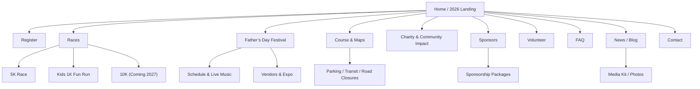

# Bronte Harbour Classic Website Deep Research and PRD Inputs

## Executive summary

Bronte Harbour Classic is already positioned as more than a race: your current landing page frames it as an inaugural, professionally timed Father’s Day “race + festival” at Bronte Harbour Park (Sunday, June 21, 2026; 8:00 a.m. start) with Kids 1K, live music, vendors, and family activities. citeturn6view0turn10view0turn28view0 This is a strong differentiator in local search (Oakville + Father’s Day + waterfront) and in “AI search”/LLM summarization, because it creates a single, memorable concept that can be described clearly and consistently across pages, directories, and sponsors. citeturn28view0turn10view0turn18view0turn18view1

To build a **high-traffic, SEO- and LLM-friendly** official site with Astro 5, the strategy is:

Build a **dedicated “official source of truth”** website with a clean URL structure per year (e.g., `/2026/`) so search engines can index one canonical page per specific event instance—this aligns with Google’s event structured-data guidance that each event should have a unique URL and markup on that URL. citeturn15search0turn30search0 Then support that page with **supporting leaf pages** (Schedule, Course Map, Vendors, Sponsors, Volunteer, FAQ, Travel/Parking) that answer the top questions users (and AI assistants) try to resolve, and that reduce reliance on PDFs/external forms. citeturn30search7turn23view1turn6view0

Your biggest near-term lift is not “more sophisticated UI.” It’s (1) **information architecture**, (2) **structured data (JSON-LD)**, (3) **performance/Core Web Vitals**, and (4) **measurement** end-to-end (click-outs to Race Roster + registrations + donations). Google explicitly calls out structured data as a standardized way to help it understand page content, and it maintains separate requirements for Event and FAQ markup. citeturn15search7turn15search0turn15search4

Finally, for “LLM-wise” visibility (ChatGPT search, etc.), you should explicitly decide what to allow: OpenAI documents separate crawlers for search (OAI-SearchBot) vs training (GPTBot), and provides user-agent strings and robots guidance. citeturn18view0turn18view1 Allowing OAI-SearchBot supports discoverability in ChatGPT search features, while you can independently disallow GPTBot if you prefer. citeturn18view0turn18view1

## Current-state audit of your existing TapeGeeks event page and Race Roster page

### What exists today

Your **current TapeGeeks “Events” landing page** for the event includes core conversion elements: a strong hero, a countdown, credibility markers (“Town of Oakville Approved • Professionally Timed”), clear primary CTA(s) to register, on-page contents navigation, race details (date/time/location), festival positioning, pricing tiers, FAQ, and sponsor blocks. citeturn6view0 It also includes accessibility positives like a “Skip to main content” link, and meaningful image alt text in at least some hero/section images (as rendered in text extraction). citeturn6view0

Your **Race Roster event page** clearly communicates the combined “race + full-day festival” concept, includes date/time/location, sponsors, donation block, and a “Visit Website” link currently set to an official domain (bronteharbourclassic.com). citeturn10view0

Important constraint: when attempting to access the deeper Race Roster registration path via automated navigation, the registration endpoint returned **403 Forbidden**, so the checkout-step-by-step UX could not be fully audited here. citeturn11view0turn11view1

### Audit checklist with observed gaps and recommended fixes

The table below is written as a **build checklist** you can convert directly into tickets.

| Area | TapeGeeks event page observations | Race Roster observations | What’s missing / weak (impact) | Recommendation for the new official Astro site |
|---|---|---|---|---|
| Page purpose & positioning | Strong positioning: “Inaugural Event… Father’s Day Festival… Race + Festival + Live Music + Local Vendors + Family Fun.” citeturn6view0 | Strong narrative emphasising “race + festival,” vendors, jumping castle, live bands. citeturn10view0 | Messaging is strong, but spread across platforms; risk of inconsistency and “thin” official source. | Make the official site the canonical “truth,” then point Race Roster + directories to it consistently. Google event guidelines reward a single clear event page per event instance. citeturn15search0turn30search0 |
| Core event facts “at a glance” | Date/time/location are present and scannable. citeturn6view0 | Date/time/location present; “Visit Website” link present. citeturn10view0 | Missing a standardized “Event facts” block that’s schema-ready and repeatable across pages. | Create a fixed “Event facts” component (date/time, distances, location, parking, accessibility, refund/transfer policy, contact, charity). Pair it with JSON-LD Event. citeturn15search0turn16search0turn30search7 |
| Content completeness for race-day decisions | Race details and pricing are solid. citeturn6view0 | Good high-level description; registration fees listed. citeturn10view0 | Likely missing (or not prominent): detailed schedule/timeline, course map GPX/PDF + embedded map, parking/transit, road closures, bib pickup, awards categories, safety/medical info, weather plan, stroller/wave guidance in one place. (These are the top “will I show up?” questions.) | Add dedicated leaf pages (Schedule, Course + Map, Travel/Parking, Packet Pickup, Safety). Link prominently from the primary landing page. This mirrors Race Roster’s own best practice to keep the homepage clean while linking to detailed custom pages. citeturn35view0turn35view1 |
| Festival content depth | Festival is described, but mostly at a headline level. citeturn6view0 | Festival is described (vendors, jumping castle, post-race). citeturn10view0 | Missing: vendor list (even “TBA”), music lineup framework (time blocks), kids zone details (ages, hours), food/beverage details, accessibility, what’s free vs paid. | Create a dedicated Festival page + Schedule page (race + festival timeline). This is also LLM-friendly: assistants can answer “What’s there besides the race?” precisely. citeturn18view1turn30search7 |
| Sponsor conversion | Sponsors are displayed and categories listed; sponsorship packages link appears to be an external form. citeturn6view0 | Sponsors block exists. citeturn10view0 | Sponsorship “sell sheet” likely not indexable if it’s locked in forms/PDFs; slower path for inbound sponsor leads. | Build an SEO-indexable Sponsorship page (packages, benefits, audience, deadlines) + a short sponsor inquiry form. Keep PDF optional. Facilitate links/crawlable CTAs. citeturn30search7turn15search7 |
| Vendor & volunteer conversion | Volunteer form is external; vendors are mentioned but not operationalized. citeturn6view0 | Race Roster has a Volunteer nav item. citeturn10view0 | Missing a vendor/expo page with booth options, load-in/out, power, insurance, food rules; volunteer roles/time slots. | Add Vendors/Expo page + Volunteer page templates. Keep the forms on your domain (or at least embedded) to maintain trust and tracking. citeturn30search7turn29search1turn18view1 |
| SEO metadata (titles/descriptions/canonicals) | Not reliably verifiable via text extraction; needs source inspection. citeturn6view0 | Race Roster is on their domain; you can’t fully control SERP snippet. citeturn10view0 | Risk: non-ideal titles/descriptions, missing canonicals, weak share previews. Google says titles matter and provides best practices. citeturn30search3 | In Astro: enforce per-page `<title>`, meta description, canonical, Open Graph/Twitter card defaults, and correct language. Use Google title-link best practices. citeturn30search3turn30search0 |
| Structured data (JSON-LD) | No Event/FAQ JSON-LD detected in extracted text; treat as missing until verified in source. citeturn6view0 | Not controlled (Race Roster). citeturn10view0 | Missing Event + Offer markup reduces eligibility for event-rich results and reduces machine-readable clarity. Google requires markup based on schema.org types for event rich results. citeturn15search0turn16search0 | Implement: `Event` + `Offer` on the main event page; `FAQPage` on FAQ pages. Validate with Google Rich Results Test. citeturn15search0turn15search4turn15search14 |
| Registration/checkout UX | Off-site CTA to Race Roster (clear pricing). citeturn6view0 | Registration entry exists, but deeper registration pages blocked to audit here (403). citeturn11view0turn11view1 | Highest-friction step is “leaving site + account creation.” Also: unclear drop-off points without tracking. | Keep primary CTA, but add: “What happens next” microcopy, and optionally an embedded registration module if Race Roster supports your desired embed path. Also implement event tracking + UTM strategy. citeturn35view2turn30search7 |
| Analytics & attribution | Not verifiable; current landing appears to be on Shopify, which often has its own analytics but may not attribute cross-domain registration well by default. citeturn6view0 | Race Roster offers Google Analytics integration. citeturn35view2 | Missing: unified funnel view (landing → click-out → registration start → purchase complete → donation). | Implement GA4 (or equivalent) on the official site, track outbound clicks to Race Roster, and use Race Roster GA integration where feasible. citeturn35view2turn30search2 |
| OpenAI/LLM discoverability controls | Not configured (unknown). | Not relevant. | If robots rules accidentally block AI-search crawlers, you lose traffic; if you accidentally allow training when you don’t want to, you may be uncomfortable. OpenAI distinguishes OAI-SearchBot (search) vs GPTBot (training) and provides user-agent strings. citeturn18view0turn18view1 | Create an explicit robots.txt and decide: allow OAI-SearchBot; allow or disallow GPTBot independently. citeturn18view0turn15search5 |
| Accessibility | Some good signs (skip link), but full WCAG audit not possible from text. citeturn6view0 | Not applicable. | Risk: forms, map embeds, accordions/FAQs, and “sticky CTA” interactions can break keyboard/screen reader navigation if not implemented with semantic HTML/ARIA. OpenAI’s accessibility guidance for Agent also explicitly references ARIA best practices. citeturn18view1turn29search1 | Build to WCAG 2.1 AA and ARIA APG patterns; test keyboard-only and screen readers for key flows. citeturn29search11turn29search1 |

## Competitive analysis of top race and festival sites

To ground the PRD in what actually works at scale, the table below compares **11** high-profile race/festival sites. The focus is: conversion patterns, content architecture, and what they prioritize above-the-fold.

Notes on “traffic/SEO signals”: where accessible, the table cites public snapshots from Similarweb/SEMrush-style pages; treat these as **estimates** and directional only. citeturn19search3turn31search0turn19search4turn34search6

| Site | Traffic / SEO signals (if available) | Key UX/SEO strengths to copy | Registration flow pattern | Mobile performance signals (qualitative) | Notable copy / CTA pattern |
|---|---|---|---|---|---|
| TCS Toronto Waterfront Marathon citeturn23view0turn32search15 | Similarweb indicates Organic Search is a primary source (with Direct also strong). citeturn32search15 | Ultra-clear above-the-fold: date range + countdown + “Register for 2026” with distinct race cards. citeturn23view0 Strong internal structure (Event info, race weekend pages). citeturn23view1 | Links out to Race Roster for registration (“Register Now”). citeturn23view0 | Simple layout and prominent CTAs suggest mobile-first priorities. citeturn23view0 | Repeatable CTA: “Register Now” at each distance card. citeturn23view0 |
| Run Ottawa (Tamarack Ottawa Race Weekend) citeturn23view2turn31search0 | Similarweb snapshot includes engagement metrics and shows Organic Search as a major source. citeturn31search0 | Festival framing: “Race Weekend” as a multi-event experience. Clear dual CTAs: Register + Volunteer. citeturn23view2 | Registration handled via an external platform (“Let’s Do This”). citeturn23view2 | Clean hero + large CTAs. citeturn23view2 | “REGISTER FOR 2026” + “VOLUNTEER FOR 2026” equals multi-sided marketplace conversion. citeturn23view2 |
| Vancouver Sun Run citeturn23view3turn33search16 | Traffic metrics not reliably captured here; use as UX reference. | Strong “Choose your event” selector reduces choice paralysis by presenting options as tiles (10K, mini, virtual, teams). citeturn23view3 | “Find out more” routes users into a dedicated registration system subdomain. citeturn23view3turn20search6 | Tile-based navigation is typically mobile-friendly. citeturn23view3 | “CHOOSE YOUR EVENT” puts selection before details, matching how many people decide. citeturn23view3 |
| BMO Vancouver Marathon citeturn23view4turn23view5turn33search1 | Similarweb competitor snapshot shows large total visits (historical snapshot) and strong category rank in Canada (directional). citeturn33search1 | Strong destination positioning + “Races for everyone” with Kids Run included, mirroring your future expansion (10K, etc.). citeturn23view5 Strong navigation to Expo/Volunteer/Travel info. citeturn20search11 | On-site registration section; details then route to entry. citeturn23view5turn20search11 | Content density is high; for Bronte, keep dense pages but use “At a glance” anchors for mobile. | “Vancouver’s Only Marathon Event” is a sharp positioning line; Bronte needs an equally sharp “Only Father’s Day waterfront race-festival” style line. citeturn23view5turn6view0 |
| Bank of America Chicago Marathon citeturn23view6turn34search15 | Semrush snapshot shows meaningful traffic (though dated) and the brand is globally recognized. citeturn34search15 | Extremely strong information architecture: “Apply” route clearly explains entry methods and nudges newsletter sign-up when lotteries aren’t open. citeturn23view6 | Application/entry is multi-path (lottery/charity/tour operator). citeturn23view6 | The apply page is mostly text + CTAs, generally good for CWV. citeturn23view6 | “Join our… e‑newsletter” is a classic “capture demand even if you can’t sell now.” citeturn23view6 |
| Boston Marathon (B.A.A.) citeturn24view0turn19search2 | Similarweb snapshot shows strong Organic Search share as a top channel (directional). citeturn19search2 | “Info for Athletes / Spectators / Volunteers” segmentation is excellent for answering user intent quickly. citeturn24view0 | Registration happens through an official platform (“Athletes’ Village”) and separate qualification pages. citeturn24view0turn21search5 | Large nav, clear headings, and scannable blocks. citeturn24view0 | They use authority-building statistics + history; Bronte should use community trust signals (charity impact, town approvals, timing partner). citeturn24view0turn6view0 |
| NYRR / NYC Marathon (high-traffic example) citeturn23view7turn19search4turn19search0 | Semrush snapshot shows millions of visits in peak months (directional), indicating huge demand. citeturn19search4 | Uses a queue / virtual waiting room (Cloudflare Virtual Waiting Room) to manage peak demand. citeturn23view7 Even if Bronte isn’t at this scale, the principle matters: protect registration windows and avoid crashes. | Dedicated platform/queue before final content. citeturn23view7 | Heavy infrastructure; not a model to copy directly, but a model to “plan for spikes.” citeturn23view7 | Pattern: strong demand management before content delivery. citeturn23view7 |
| London Marathon Events citeturn23view8turn34search6 | Semrush snapshot shows high UK traffic (directional). citeturn34search6 | Ballot/entry explanation is extremely clear, reducing confusion. citeturn23view8 Bronte can use similar clarity for refund/transfer/deferral policies. citeturn6view0turn28view1 | Ballot-based entry; not directly relevant but the clarity framework is. citeturn23view8 | Text-forward pages usually perform well on mobile if structured well. | “What happens next?” content reduces support burden; same benefit for Bronte. citeturn23view8turn6view0 |
| Rock ’n’ Roll Running Series citeturn25view0turn34search0 | Similarweb AI-traffic page exists (directional signal that AI referrals can be measured). citeturn34search0 | The clearest “race + entertainment” positioning: explicitly says it turns the finish line into a music festival. citeturn25view0 Bronte should lean into *festival after the race* as the central promise. citeturn6view0 | Event directory → event details → registration. citeturn25view0 | Card-based event browsing is mobile-friendly. citeturn25view0 | “Find your event” + “See event details” is a proven browsing funnel. citeturn25view0 |
| runDisney citeturn23view10turn33search2 | Similarweb snapshot exists for the domain (directional). citeturn33search2 | “Plan your trip,” training content, FAQ, and strong “what to expect” storytelling. citeturn23view10turn22search1 Bronte can adapt “plan your day” (parking, schedule, family zones). | Account-based event registration via Disney ecosystem. citeturn22search1 | Highly curated, short above-the-fold content blocks. citeturn23view10 | Value-prop bullets (“Theme park race experiences… entertainment & medals”) are compact and LLM-friendly. citeturn23view10 |
| Tough Mudder Toronto citeturn23view11turn33search3 | Similarweb snapshot shows strong Direct and Organic mix (directional). citeturn33search3 | Excellent conversion mechanics: pricing is explicit, and “what you get” is itemized (medal, shirt, etc.). citeturn23view11 | “Register” drives to a dedicated ticketing domain checkout. citeturn23view11 | Heavy media, but strong modular structure (“What you get”). citeturn23view11 | “WHAT YOU GET” is one of the highest-converting patterns you should copy (swag + festival access + charity impact). citeturn23view11turn6view0 |

## Recommended site architecture, sitemap, and page templates

### Core architecture principles

The new site should be built around **one canonical event “season”** (2026) as the centre of gravity, with supporting pages that satisfy specific intents (“Where do I park?”, “What time is the kids run?”, “How do I become a vendor?”). This aligns with Google’s guidance that event markup should live on the event’s specific page and that each event should have its own unique URL. citeturn15search0turn30search0

### Proposed sitemap

This is optimized for both **human navigation** and **LLM summarization**: each page answers a single cluster of questions.



### Page templates and reusable modules

| Template | Primary goal | Required modules (MVP) | Add-ons (v2) |
|---|---|---|---|
| Landing (Home / 2026) | Convert (register / vendor / sponsor / volunteer) | Hero + countdown + 3 CTAs; “At a glance” facts; “Choose your distance”; festival highlights; sponsor strip; FAQ preview; map teaser; email capture | Testimonials; training tips carousel; “last price increase” urgency automation |
| Race detail (5K, Kids 1K) | Clarify fit + reduce questions | Distance overview; who it’s for; start time; route summary; “what you get”; pricing tiers; rules (strollers, age); awards; CTA | Embedded results after event; training plan downloads |
| Registration hub | Reduce drop-off | One-page “How registration works” + pricing + buttons; FAQ on transfers/refunds; UTM-tagged outbound links | Embedded registration if feasible; post-purchase “Add to calendar” |
| Festival | Make it a “day plan” | Kids zone details; vendor market overview; live music concept; food info; “bring the family” CTA | Lineup page; vendor list with filters; interactive site map |
| Course & map | Confidence + logistics | Route map embed; GPX/PDF links; start/finish; aid station plan; accessibility; stroller guidance | Interactive elevation, turn-by-turn, spectator zones |
| Schedule | Reduce support load | Minute-by-minute timeline (race + festival); “where to be when” | Calendar download; last-updated stamp |
| Sponsors | Deliver sponsor value + sell packages | Sponsor tier grid; logo links; sponsor benefits; “Become a sponsor” CTA | Sponsor spotlight posts; ROI metrics post-event |
| Vendors/Expo | Vendor conversion | Booth options; apply CTA; load-in/out; required docs; deadlines | Vendor portal; payment options; featured vendors |
| Volunteer | Volunteer conversion | Roles + shifts; apply CTA; perks; contact | Volunteer management integrations |
| FAQ | Self-serve answers | Accordion FAQ; contact fallback | FAQPage schema per section |
| News/Blog | SEO growth | Event updates; training tips; community stories | RSS feed; author profiles |
| Media kit | PR + backlinks | Story, stats, press contact, downloadable assets | Press release archive |
| Contact | Lead capture | Structured contact form, emails, hours | Spam protection + routing rules |

## PRD outline with prioritized features, acceptance criteria, KPIs, analytics events, timeline

### Product goals

Primary outcome: **Increase registrations + festival attendance + sponsor/vendor leads** while reducing organizer support overhead (fewer repetitive questions). This depends on (1) better information, (2) faster site, (3) measurable funnel. Google explicitly positions sitemaps, crawlable links, and structured data as mechanisms that help Google discover and understand pages. citeturn30search6turn30search7turn15search7

### MVP vs v2 feature prioritization

| Feature | Priority | Acceptance criteria |
|---|---|---|
| New official domain/site + canonical URL strategy (2026 landing) | MVP | One indexable landing page per year; correct `<title>`, meta description, canonical, and `lang="en-CA"`; passes basic technical SEO checks. citeturn30search3turn30search0 |
| Event facts component (schema-ready) | MVP | “At a glance” appears above fold; content matches Race Roster facts (date/time/location/distances). citeturn10view0turn15search0 |
| Registration hub (Race Roster outbound) with UTM strategy | MVP | All register CTAs include UTM parameters; outbound clicks tracked; clear “you’ll register on Race Roster” microcopy. citeturn35view2turn30search2 |
| JSON-LD: Event + Offer + Organization + FAQPage | MVP | Validates in Google Rich Results Test (no critical errors); event pages include required properties per Google Event documentation. citeturn15search0turn15search14turn16search0turn16search16 |
| Course & map page | MVP | Map loads accessibly with text fallback; includes route summary, start/finish, parking link. citeturn6view0turn29search0 |
| Schedule page | MVP | Timeline for race morning + festival; provides a “last updated” stamp; linked from landing. |
| Sponsors page + sponsor inquiry form | MVP | Sponsor logos and tiers; inquiry form submits successfully with confirmation email; form is accessible and keyboard-usable. citeturn29search1turn29search11 |
| Vendors/Expo page + vendor intake form | MVP | Vendor requirements + application; accessible form; spam protection enabled. |
| Volunteer page + intake form | MVP | Volunteer roles listed; form routes to organizer email; confirmation message shown. |
| Newsletter capture | MVP | Email capture integrated; double opt-in if platform supports; tracked as conversion. |
| Performance baseline (CWV hygiene) | MVP | Meets CWV best practices focus (LCP/INP/CLS monitored); no unoptimized hero images; avoids layout shift. citeturn15search3turn14search2turn15search16 |
| Blog/news + RSS feed | v2 | RSS feed generated; content collection supports tags; at least 6 evergreen posts. citeturn27search1turn30search7 |
| Post-event results + gallery | v2 | Results and photo links published within 48 hours post-event; shareable gallery pages. |
| Multi-language (optional fr-CA) | v2 | If implemented, hreflang relationships are correct. citeturn30search1turn14search3 |
| “10K coming 2027” interest list | v2 | Dedicated page captures interest emails; tracked. |

### KPIs and success metrics

KPIs should be tied to the business outcomes and measurable in analytics:

| KPI | Definition | Target direction |
|---|---|---|
| Registration click-through rate (CTR) | % of sessions that click “Register” | Up |
| Registration conversion (site-attributed) | % of sessions resulting in confirmed registrations (via Race Roster reports or integrations) | Up |
| Sponsor leads | # sponsor form submits / month | Up |
| Vendor leads | # vendor form submits / month | Up |
| Volunteer signups | # volunteer form submits / month | Up |
| Organic search growth | Impressions + clicks in Google Search Console | Up citeturn30search2turn15search3 |
| CWV health | % URLs “Good” in Search Console CWV report | Up citeturn15search3 |
| AI-search referrals | Visits with referrer/UTM indicating AI sources (e.g., utm_source=chatgpt.com) | Up citeturn18view1 |

### Suggested analytics event list

Race Roster can integrate Google Analytics (platform feature), and your site should track conversion intent before the click-out. citeturn35view2

Core events to implement in GA4 (or equivalent):

| Event name | When it fires | Key parameters |
|---|---|---|
| `view_event_facts` | Event facts component enters viewport | `event_year`, `page_type` |
| `click_register` | Any register CTA click | `cta_location`, `race_type`, `price_tier`, `outbound_url` |
| `outbound_raceroster` | Click out to Race Roster | `utm_campaign`, `race_type` |
| `click_sponsor_inquiry` | Sponsor CTA click | `cta_location` |
| `submit_sponsor_form` | Sponsor form submit success | `package_interest` |
| `submit_vendor_form` | Vendor form submit success | `booth_type` |
| `submit_volunteer_form` | Volunteer submit success | `role_interest` |
| `open_map` | Map interaction | `map_provider` |
| `download_gpx` / `download_pdf` | Download route assets | `asset_type` |
| `newsletter_signup` | Email capture success | `source_page` |
| `share_social` | Share click | `network`, `page_type` |

### Timeline estimate

These are realistic, Astro-friendly sequencing estimates. (Adjust based on team size, content readiness, and whether you add a CMS.)

| Phase | Scope | Estimate |
|---|---|---|
| Discovery + content inventory | Confirm key facts, assets, sponsor tiers, vendor rules | 3–5 days |
| IA + wireframes | Sitemap + page module specs | 4–7 days |
| Visual design | Landing + race detail + festival + sponsor templates | 7–14 days |
| Astro implementation (MVP) | Templates + content collections + forms + analytics + schema + sitemap | 2–4 weeks |
| QA | Accessibility checks, CWV pass, structured data validation | 4–7 days citeturn15search14turn29search0turn15search3 |
| Launch + monitoring | Search Console, sitemap submission, dashboards | 2–3 days citeturn30search2turn15search12 |

### Budget estimate ranges

Because constraints were not provided, here are typical ranges (CAD) for planning only:

| Line item | Range (CAD) | What drives variance |
|---|---:|---|
| Brand/visual design (basic → premium) | $2,500–$12,000 | Custom illustration, motion, number of templates |
| Astro build (MVP) | $6,000–$25,000 | Template count, forms, integrations, QA depth |
| Content production | $1,000–$10,000 | Copywriting depth, translations, photography |
| Ongoing SEO/content (optional) | $500–$3,000/month | Blog cadence, outreach, reporting |

## Technical implementation requirements for Astro 5

### Rendering strategy

Astro defaults to pre-rendering pages in static output mode; you can selectively opt into on-demand rendering by adding an adapter and setting `export const prerender = false` for specific routes/endpoints. citeturn27search16turn27search10turn14search0

For Bronte Harbour Classic, the recommended default:

Use **SSG (static)** for almost everything, because it’s fast, cheap to host, and great for CWV/SEO. citeturn27search6turn15search3 Use **hybrid** only if you need true server-side behaviour (e.g., secure form handling on your server runtime, or real-time registration counts). Astro documents both “server” and “hybrid” as on-demand rendering modes once an adapter is installed. citeturn14search0turn14search7

### Integrations and tooling

Race Roster provides:

Race Roster platform integrations (including Google Analytics and MailChimp) citeturn35view2 and an API that returns JSON, with OAuth client credentials managed via an API settings page. citeturn35view3turn12search5

Recommended integration approach:

1) Keep Race Roster as the system of record for registration/payments (fastest path; least risk).
2) On-site, instrument the click-out funnel + UTMs + “what happens next” copy.
3) If you need dynamic data, use Race Roster API endpoints (where permitted) to pull:
   * pricing/deadlines
   * participant counts
   * results post-event  
   (Exact endpoints depend on your developer access and API scope.) citeturn35view3turn12search5

### Forms, email, and spam prevention

If you remain fully static, Astro endpoints that process form submissions require opting out of prerendering per endpoint (`prerender = false`) or using an SSR adapter. citeturn14search15turn14search0

MVP recommendation: use a hosted form handler (or serverless function) with:
- server-side validation
- spam protection (honeypot + rate limiting)
- email notifications and a simple CRM export

### CDN, assets, and media

Astro recommends storing images in `src/` when possible so Astro can “transform, optimize, and bundle” them, while `public/` assets are shipped as-is. citeturn14search2turn27search5

Astro also explicitly notes it has **no native video support** and recommends using a hosted video service for optimizing/streaming video. citeturn14search2  
For Bronte: embed lineup/recap videos from a hosted provider rather than self-hosting large MP4 files.

### i18n and en-CA

Astro has built-in i18n routing features (configure default language, routing behaviour, preferred languages and fallbacks). citeturn14search3turn14search6  
Even if you ship English only for now:
- set HTML `lang="en-CA"`
- use Canadian spelling and formats
- structure for future fr-CA via i18n routing + hreflang if/when added. citeturn30search1turn14search3

### Sitemap and RSS

Astro’s official sitemap integration generates `sitemap-index.xml` and numbered sitemap files when configured with your deployed `site` URL. citeturn27search0turn14search1  
Google explains that a sitemap is a file that helps search engines crawl a site more efficiently and that submitting a sitemap is a hint (not a guarantee). citeturn30search6turn30search2

For PR/news updates, Astro’s RSS tooling can generate RSS feeds via endpoints. citeturn27search1turn27search4

### Robots.txt and LLM crawler control

Astro documentation explicitly shows adding a `public/robots.txt`. citeturn27search15turn27search5  
Google requires `robots.txt` to live at the root of your host and provides rules for how to create it. citeturn15search5turn15search2

OpenAI provides an “Overview of OpenAI Crawlers” distinguishing:
- **OAI-SearchBot** (for surfacing sites in ChatGPT search features)  
- **GPTBot** (for crawling content potentially used in training)  
and includes full user-agent strings and published IP lists. citeturn18view0

OpenAI also states that to be included in ChatGPT search summaries/snippets, publishers should not block OAI-SearchBot; and that referral URLs include `utm_source=chatgpt.com` for tracking. citeturn18view1

A practical robots.txt starting point (edit to your preference):

```txt
# public/robots.txt

User-agent: *
Allow: /

# Allow OpenAI search discovery
User-agent: OAI-SearchBot
Allow: /

# Optional: block model training crawl (choose based on your preference)
User-agent: GPTBot
Disallow: /

Sitemap: https://www.bronteharbourclassic.com/sitemap-index.xml
```

### Structured data JSON-LD examples

Google’s Event rich result documentation requires structured data using schema.org event types, and emphasizes that each event should have a unique URL with markup. citeturn15search0turn16search0  
FAQ structured data is documented separately (FAQPage/Question/Answer). citeturn15search4turn16search1

Below are **schema-ready** starting examples (replace values with your finalized copy and URLs):

```html
<!-- Event (main festival day / 2026 landing) -->
<script type="application/ld+json">
{
  "@context": "https://schema.org",
  "@type": "Event",
  "name": "Bronte Harbour Classic 2026 (5K + Kids 1K + Father’s Day Festival)",
  "description": "Inaugural Bronte Harbour Classic 5K and Kids 1K in Oakville, Ontario, followed by a Father’s Day waterfront festival with live music, vendors, and family activities.",
  "startDate": "2026-06-21T08:00:00-04:00",
  "endDate": "2026-06-21T17:00:00-04:00",
  "eventStatus": "https://schema.org/EventScheduled",
  "eventAttendanceMode": "https://schema.org/OfflineEventAttendanceMode",
  "url": "https://www.bronteharbourclassic.com/2026/",
  "image": [
    "https://www.bronteharbourclassic.com/assets/bronte-harbour-park-aerial.jpg"
  ],
  "location": {
    "@type": "Place",
    "name": "Bronte Harbour Park",
    "address": {
      "@type": "PostalAddress",
      "addressLocality": "Oakville",
      "addressRegion": "ON",
      "addressCountry": "CA"
    }
  },
  "organizer": {
    "@type": "Organization",
    "name": "Bronte Runners Club",
    "url": "https://www.bronteharbourclassic.com/"
  },
  "offers": [
    {
      "@type": "Offer",
      "name": "Bronte Harbour Classic 5K Registration",
      "url": "https://raceroster.com/events/2026/111468/bronte-harbour-classic-5k",
      "priceCurrency": "CAD",
      "availability": "https://schema.org/InStock",
      "validFrom": "2025-10-11T00:00:00-04:00"
    },
    {
      "@type": "Offer",
      "name": "Kids 1K Fun Run Registration",
      "url": "https://raceroster.com/events/2026/111468/bronte-harbour-classic-5k",
      "priceCurrency": "CAD",
      "availability": "https://schema.org/InStock"
    }
  ]
}
</script>
```

```html
<!-- FAQPage (FAQ page) -->
<script type="application/ld+json">
{
  "@context": "https://schema.org",
  "@type": "FAQPage",
  "mainEntity": [
    {
      "@type": "Question",
      "name": "What distances are available?",
      "acceptedAnswer": {
        "@type": "Answer",
        "text": "We offer a chip-timed 5K and a Kids 1K Fun Run."
      }
    },
    {
      "@type": "Question",
      "name": "Where does the race take place?",
      "acceptedAnswer": {
        "@type": "Answer",
        "text": "Bronte Harbour Park in Oakville, Ontario."
      }
    }
  ]
}
</script>
```

```html
<!-- Organization (top-level organizer or operating group) -->
<script type="application/ld+json">
{
  "@context": "https://schema.org",
  "@type": "Organization",
  "name": "Bronte Harbour Classic",
  "url": "https://www.bronteharbourclassic.com/",
  "email": "info@bronteharbourclassic.com",
  "sameAs": [
    "https://www.facebook.com/YourPageHere",
    "https://www.instagram.com/YourPageHere"
  ]
}
</script>
```

```html
<!-- LocalBusiness (use only if the entity is truly a local business/entity with a physical location) -->
<script type="application/ld+json">
{
  "@context": "https://schema.org",
  "@type": "LocalBusiness",
  "name": "Bronte Harbour Classic Race HQ",
  "address": {
    "@type": "PostalAddress",
    "addressLocality": "Oakville",
    "addressRegion": "ON",
    "addressCountry": "CA"
  },
  "areaServed": "Oakville, Ontario, Canada"
}
</script>
```

Why these matter: schema.org defines `Event` as an event happening at a time/place and notes ticketing info can be provided via `offers`. citeturn16search0turn16search11turn16search16 Google’s Event documentation ties eligibility for event rich results to having schema.org event markup on the event page. citeturn15search0turn15search1

## SEO, LLM visibility, content, UX, and accessibility guidelines

### SEO and information architecture rules that matter most

Google’s docs emphasize that structured data helps it understand content, and provide specific requirements/guidelines for Event and FAQ markup. citeturn15search7turn15search0turn15search4 Google also provides best practices for title links (SERP titles) and guidance on canonical URLs to consolidate duplicates. citeturn30search3turn30search0turn30search4

For Bronte Harbour Classic, implement this “SEO minimum viable standard”:

Use a per-year URL strategy:
- `/2026/` = the single canonical “event of the year” landing page
- `/2026/5k/`, `/2026/kids-1k/` = leaf pages that can each be marked up as their own Event (optional), or as race detail pages referencing the main Event (choose one strategy and be consistent). This supports Google’s “unique URL per event” guidance. citeturn15search0turn30search0

Publish a sitemap:
- Use Astro’s sitemap integration (generates sitemap index + sitemap files) citeturn27search0turn14search1  
- Submit to Google (Search Console). Google notes submission is a hint and provides submission methods. citeturn30search2turn30search6

Ensure crawlable internal links:
Google explicitly calls links a signal and explains crawlable link best practices. citeturn30search7  
For you, this means: don’t hide critical nav behind JS-only buttons; use real `<a href>` links to core pages (Schedule, Course Map, Vendors, Sponsors).

### Core Web Vitals and performance

Google’s search documentation highlights Core Web Vitals measurement across tools and explicitly references LCP, INP, and CLS. citeturn15search3turn15search16turn15search13

For your site:
- Keep it mostly static (Astro SSG) to minimize runtime complexity. citeturn27search6turn14search0
- Treat hero imagery as an LCP risk: use Astro’s image pipeline and store images in `src/` when possible. citeturn14search2
- Avoid layout shifts: reserve space for images, sponsor logo grids, and embedded maps.

### LLM visibility and “AI search” considerations

OpenAI’s crawler documentation distinguishes:
- OAI-SearchBot (search results in ChatGPT search features)
- GPTBot (training crawl)  
and provides user-agent strings + published IP ranges. citeturn18view0

OpenAI also advises publishers who want to be included in ChatGPT search summaries/snippets to ensure they are not blocking OAI-SearchBot, and notes ChatGPT includes `utm_source=chatgpt.com` on referral URLs to help analytics attribution. citeturn18view1

Practical content patterns that help both humans and LLMs (and reduce “hallucinations” about your event):

Create a visible, structured “Facts” section:
- Date, time, location, distances, who can participate, stroller policy, charity beneficiary, and what’s included.
This makes the page easy to parse and summarize.

Use FAQ pages with short answers:
FAQPage schema is supported and documented by Google. citeturn15search4turn16search1

Avoid “information only in images”:
WCAG and Google both reward text alternatives and clarity; plus LLM tools are better with real text. citeturn29search0turn15search7

### Content plan and sample copy blocks you can drop into templates

These samples are aligned to your current positioning already shown on your TapeGeeks landing and Race Roster event description. citeturn6view0turn10view0

Hero block (landing):
> **Bronte Harbour Classic 2026**  
> **5K Race + Kids 1K + Father’s Day Waterfront Festival**  
> Run by the lake at Bronte Harbour Park, then stay all day for live music, local vendors, and family fun.  
> **Sunday, June 21, 2026 • 8:00 a.m. • Oakville, ON** citeturn6view0turn10view0turn28view0  
> **Primary CTA:** Register (5K)  
> **Secondary CTA:** Register (Kids 1K)  
> **Tertiary CTA:** Festival Details

Race “what you get” (copy-ready):
> **What you get**  
> Chip-timed 5K (instant results), finisher medal, post-race festival access, sponsor swag, and the best waterfront views in Oakville. citeturn6view0turn10view0

Festival highlights (copy-ready):
> **Stay for the Father’s Day Festival**  
> After the morning races, the celebration continues: live music, a vendor market, food, and kids activities (including a jumping castle and family-friendly games). citeturn10view0turn6view0

Sponsor callout:
> **Bring your brand to the waterfront**  
> Founding and category sponsorships available—support a new Oakville tradition and reach runners, families, and local businesses in one day. citeturn6view0turn10view0  
> **CTA:** View sponsorship packages

FAQ starters (schema-ready):
- What time does the 5K start? (Answer: 8:00 a.m.) citeturn6view0turn28view0  
- Is there a kids race? (Answer: Kids 1K Fun Run.) citeturn6view0turn10view0  
- Is it stroller-friendly? (Answer: flat/paved + stroller guidance.) citeturn6view0turn28view1  

### Design and UX recommendations

These are the patterns consistently used by high-performing race/festival sites in the competitive set:

Use multi-CTA conversion above the fold:
Run Ottawa puts “Register” and “Volunteer” as parallel primary actions; you should do the same with “Register,” “Festival,” “Sponsor,” and “Vendor.” citeturn23view2turn6view0

Use a “choose your event” selector:
The Sun Run demonstrates a clean tile selector that reduces friction when there are multiple options. citeturn23view3turn33search16

Make “What you get” explicit:
Tough Mudder’s “What you get” section itemizes value and is a strong conversion driver. citeturn23view11turn6view0

Trust signals extremely early:
You already do this (“Town of Oakville Approved • Professionally Timed”). Keep these directly beside the headline/CTAs on the official site. citeturn6view0turn28view0

Checkout microcopy (reduce anxiety):
Add a short line under “Register” buttons: “Registration is processed securely on Race Roster.” (Race Roster is already your registration partner.) citeturn10view0turn35view2

### Accessibility checklist for WCAG 2.1 AA

WCAG 2.1 is the recommended standard and W3C encourages using the most current WCAG version when developing/updating accessibility policies. citeturn29search11  
Also, OpenAI’s guidance for improving website performance with ChatGPT Agent explicitly highlights that ARIA tags help it interpret page structure and interactive elements, and points to WAI-ARIA best practices. citeturn18view1turn29search1

Use this as your build checklist (test each on landing + registration hub + forms + FAQ):

| Category | WCAG 2.1 AA checklist item | How to verify |
|---|---|---|
| Keyboard access | All navigation, accordions, modals, and forms work with keyboard only | Tab through; no traps; visible focus |
| Focus & semantics | Use semantic HTML first; ARIA only when needed; follow ARIA APG patterns for components | Component review vs APG examples citeturn29search1 |
| Contrast | Text contrast meets AA minimums (4.5:1 for normal text) | Use contrast checker; W3C explains rationale and thresholds citeturn29search10turn29search2 |
| Images | All meaningful images have alt text; decorative images are ignored by screen readers | Spot-check key pages |
| Headings | One clear H1 per page; logical H2/H3 structure | Outline audit |
| Forms | Labels associated; errors described in text; success confirmations are announced | Screen reader test + keyboard test |
| Motion/media | Video has captions; avoid auto-play audio | Media test |
| Maps | Provide a text alternative (address, directions link, key landmarks) | Disable map and confirm info remains usable |
| Responsive | Content reflows without horizontal scrolling; tap targets are adequate | Mobile emulator tests |
| Docs & downloads | Avoid critical info only in PDFs; if PDFs exist, ensure they are accessible | Prefer HTML pages; validate PDFs separately |

The WCAG “How to Meet” Quick Reference is useful to filter and validate success criteria during QA. citeturn29search0